# Data Viz cheatsheet  

## Overview  

This is a repo that aims to provide a variety of charts with a simple R code to implement them. It is a cheatsheet for selecting the appropriate information for your dataset. Each type of chart comes with a sample dataset to test it first. The output plot is provided as a png file.  

## [Link Here!](https://melisadigiacomo.github.io/Rdatavizcheatsheet/)

## Code and Resources Used

**R Version:** 3.6.3  
**Packages:** ggplot2, dplyr, tidyverse, wordcloud, ggpubr, fmsb, VennDiagram, corrplot, GGally, UpSetR, quantmod, plotly
    
### **Click on the chart type to access the repo and on the chart image to access the code*

## [Barplot](https://github.com/melisadigiacomo/dataviz-cheatsheet/tree/master/barplot)

[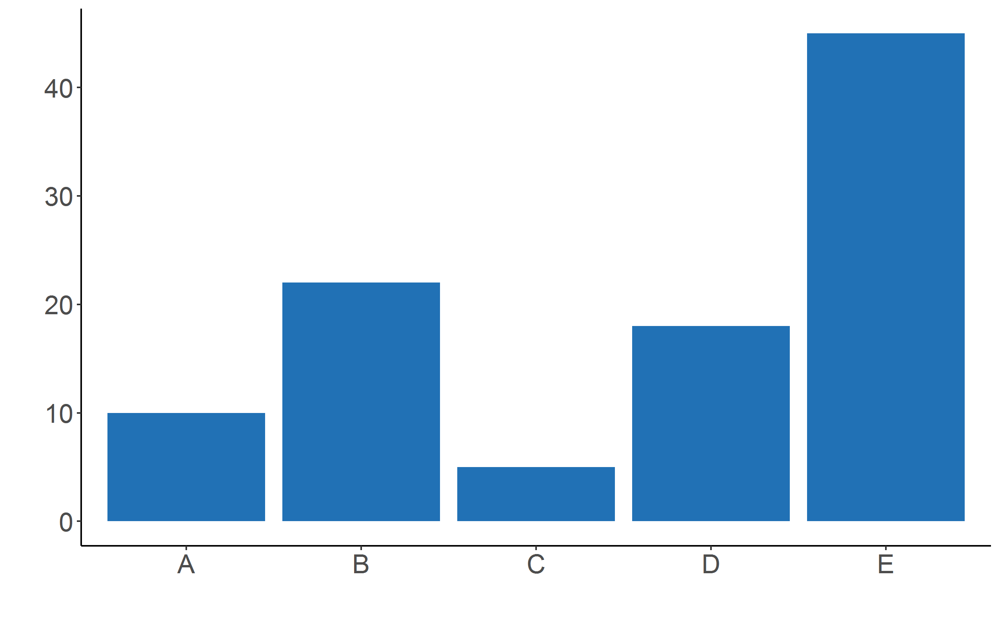](https://github.com/melisadigiacomo/dataviz-cheatsheet/blob/master/barplot/barplot.R)  

## [Pareto plot](https://github.com/melisadigiacomo/dataviz-cheatsheet/tree/master/paretochart)

[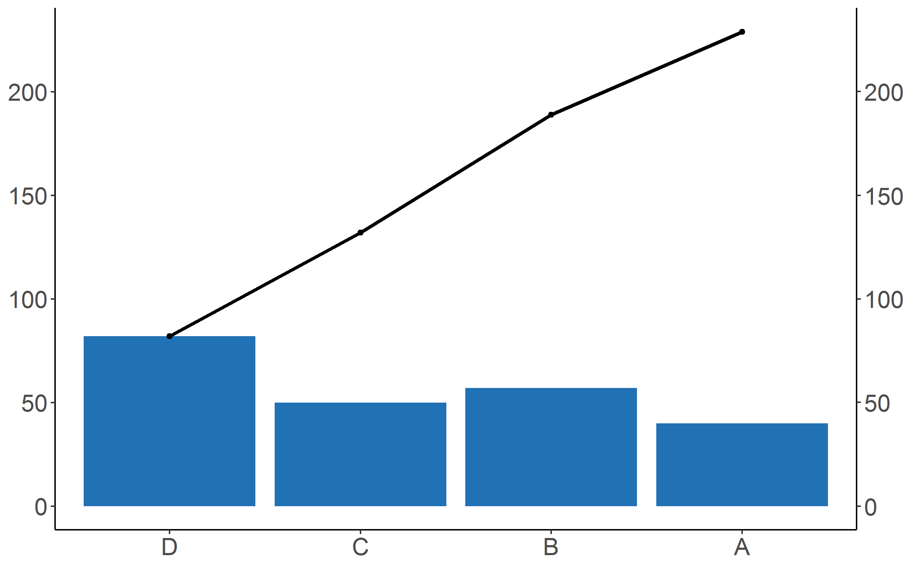](https://github.com/melisadigiacomo/dataviz-cheatsheet/blob/master/paretochart/paretochart.R) 

## [Grouped barplot](https://github.com/melisadigiacomo/dataviz-cheatsheet/tree/master/groupedbarplot)

[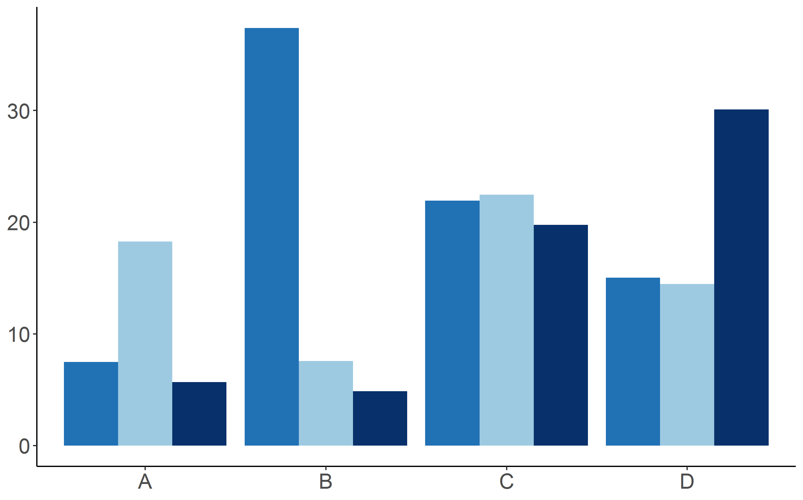](https://github.com/melisadigiacomo/dataviz-cheatsheet/blob/master/groupedbarplotbarplot/groupedbarplot.R)
## [Stacked barplot](https://github.com/melisadigiacomo/dataviz-cheatsheet/tree/master/stacked-barplot)

[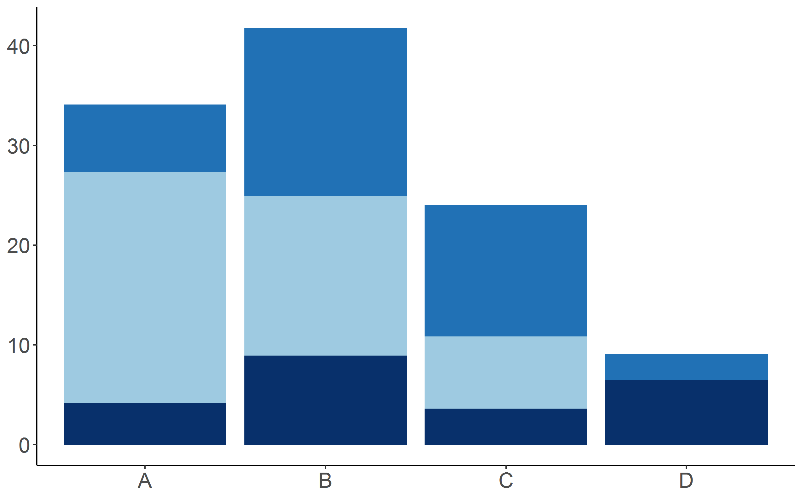](https://github.com/melisadigiacomo/dataviz-cheatsheet/blob/master/stacked-barplot/stackedbarplot.R)  

## [Percent stacked barplot](https://github.com/melisadigiacomo/dataviz-cheatsheet/tree/master/percent-stacked-barplot)

[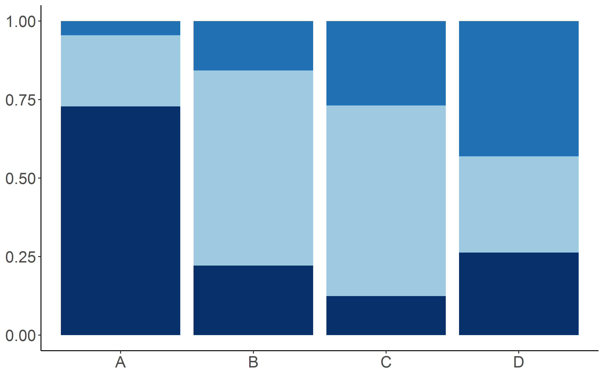](https://github.com/melisadigiacomo/dataviz-cheatsheet/blob/master/percent-stacked-barplot/percentstackedbarplot.R) 

## [Butterfly barplot](https://github.com/melisadigiacomo/dataviz-cheatsheet/tree/master/butterflyplot)

[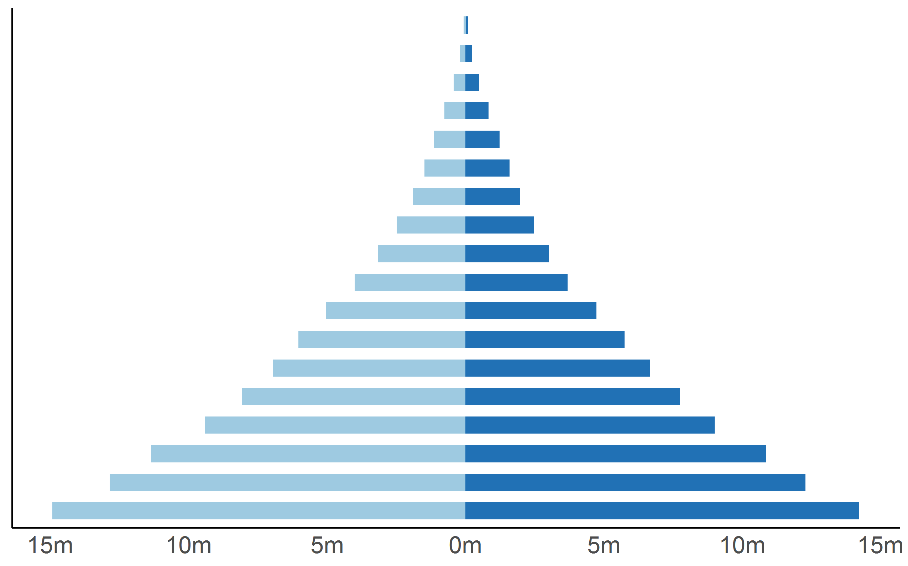](https://github.com/melisadigiacomo/dataviz-cheatsheet/blob/master/butterflyplot/butterflyplot.R) 

## [Circular barplot](https://github.com/melisadigiacomo/dataviz-cheatsheet/tree/master/circular-barplot)

[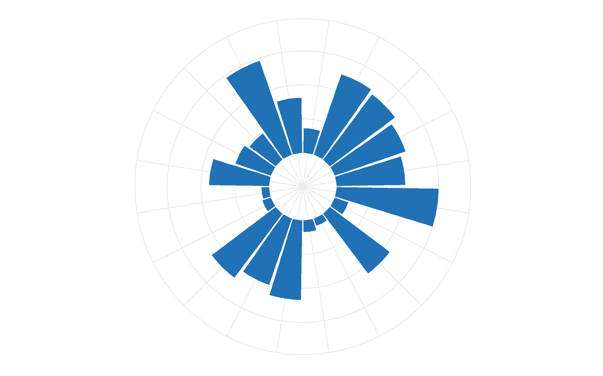](https://github.com/melisadigiacomo/dataviz-cheatsheet/blob/master/circular-barplot/circularbarplot.R)

## [Radial barplot](https://github.com/melisadigiacomo/dataviz-cheatsheet/tree/master/radial-barplot)

[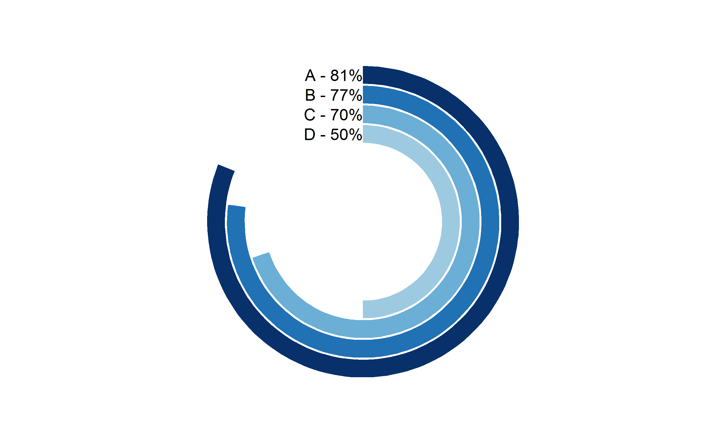](https://github.com/melisadigiacomo/dataviz-cheatsheet/blob/master/radial-barplot/radialbarplot.R)

## [Piechart](https://github.com/melisadigiacomo/dataviz-cheatsheet/tree/master/piechart)

[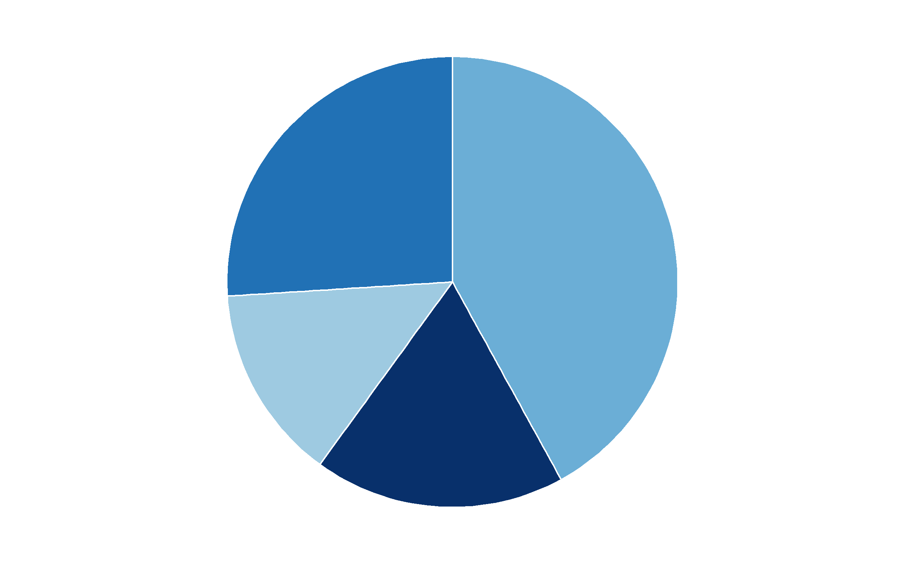](https://github.com/melisadigiacomo/dataviz-cheatsheet/blob/master/piechart/piechart.R)

## [Radar chart](https://github.com/melisadigiacomo/dataviz-cheatsheet/tree/master/radarchart)

[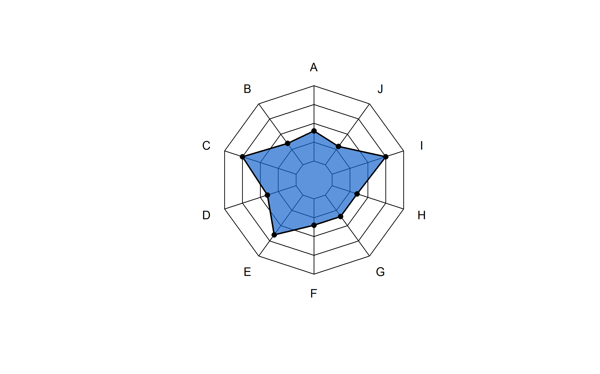](https://github.com/melisadigiacomo/dataviz-cheatsheet/blob/master/chordplot/chordplot.R)

## [Chord plot](https://github.com/melisadigiacomo/dataviz-cheatsheet/tree/master/chordplot)

[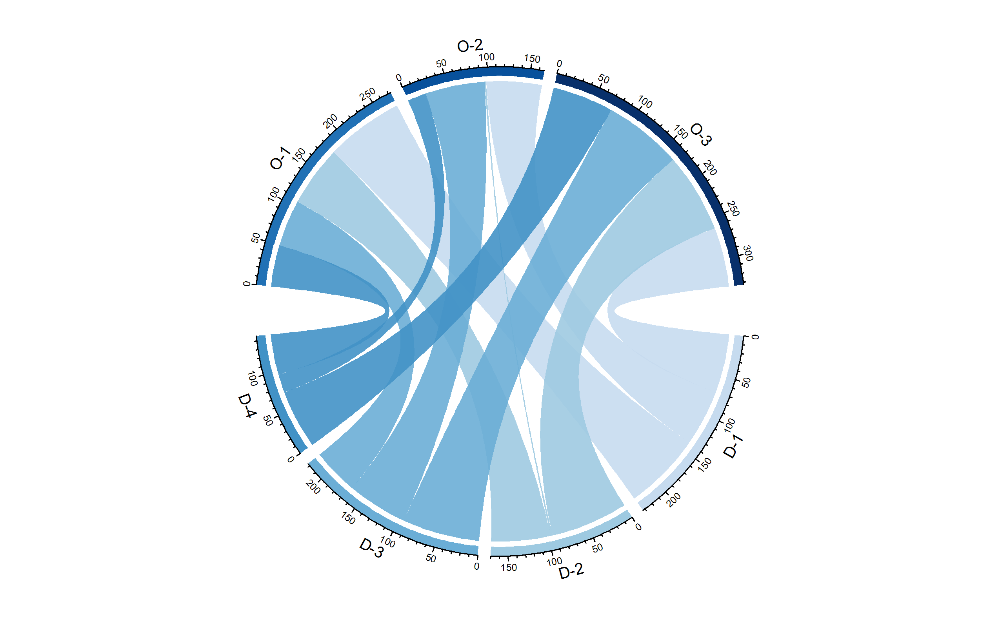](https://github.com/melisadigiacomo/dataviz-cheatsheet/blob/master/radarchart/radarchart.R)

## [Venn diagram](https://github.com/melisadigiacomo/dataviz-cheatsheet/tree/master/venndiagram)

[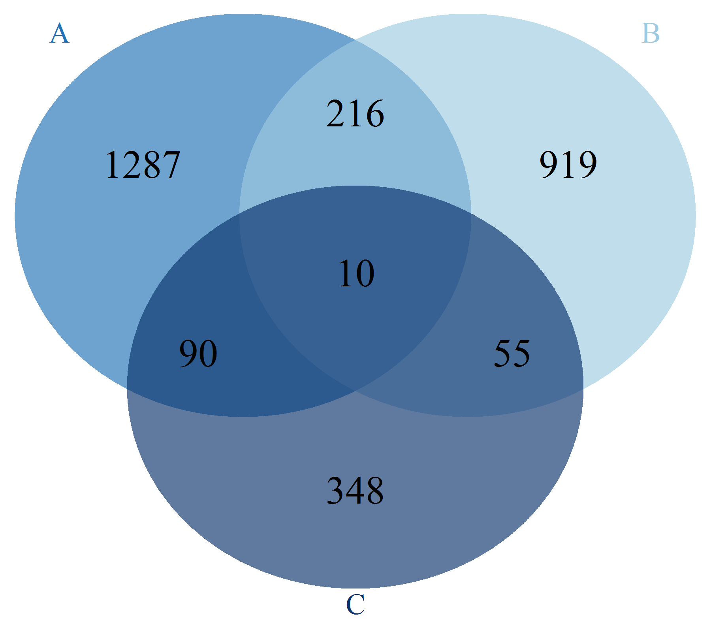](https://github.com/melisadigiacomo/dataviz-cheatsheet/blob/master/venndiagram/Venn_Diagrams.R)

## [UpSet diagram](https://github.com/melisadigiacomo/dataviz-cheatsheet/tree/master/upsetdiagram)

[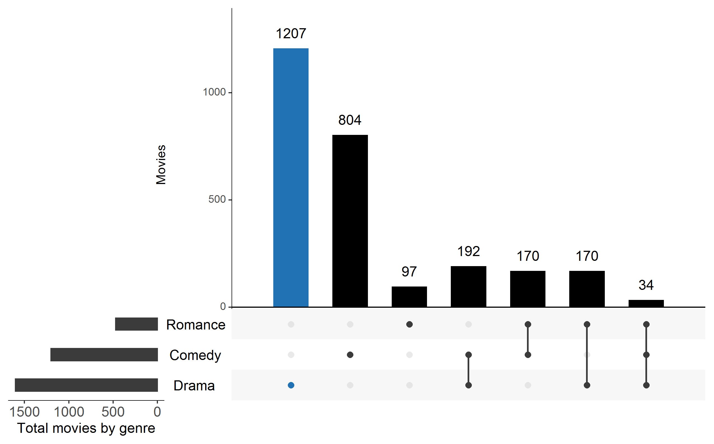](https://github.com/melisadigiacomo/dataviz-cheatsheet/blob/master/upsetdiagram/upsetdiagram.R)

## [Gauge plot](https://github.com/melisadigiacomo/dataviz-cheatsheet/tree/master/gaugeplot)

[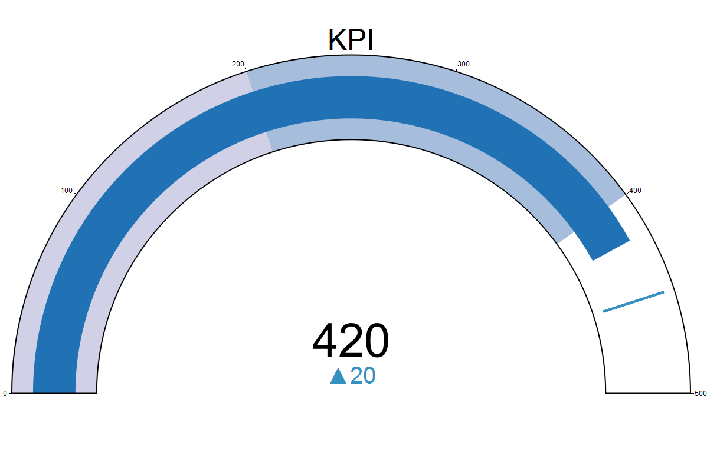](https://github.com/melisadigiacomo/dataviz-cheatsheet/blob/master/gaugeplot/gaugeplot.R)

## [Wordcloud](https://github.com/melisadigiacomo/dataviz-cheatsheet/tree/master/wordcloud)

## [Contour](https://github.com/melisadigiacomo/dataviz-cheatsheet/tree/master/contourplot)

[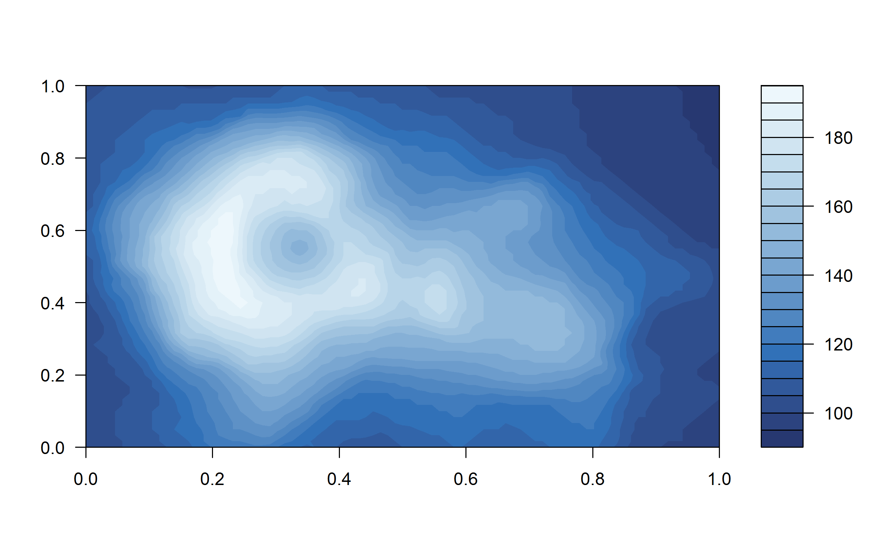](https://github.com/melisadigiacomo/dataviz-cheatsheet/blob/master/contourplot/contourplot.R)

## [Corrplot](https://github.com/melisadigiacomo/dataviz-cheatsheet/tree/master/corrplot)

[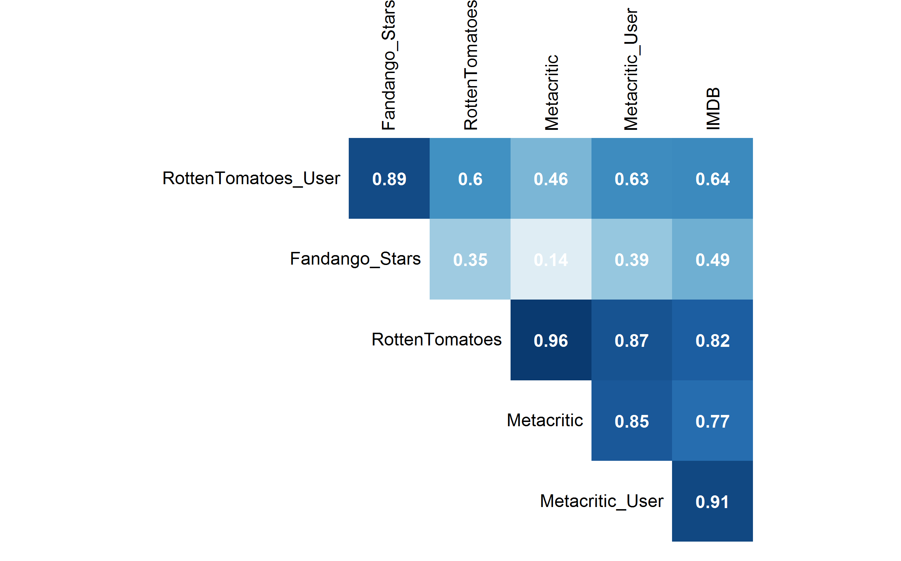](https://github.com/melisadigiacomo/dataviz-cheatsheet/blob/master/corrplot/corrplot.R)

## [Heatmap](https://github.com/melisadigiacomo/dataviz-cheatsheet/tree/master/heatmap)

[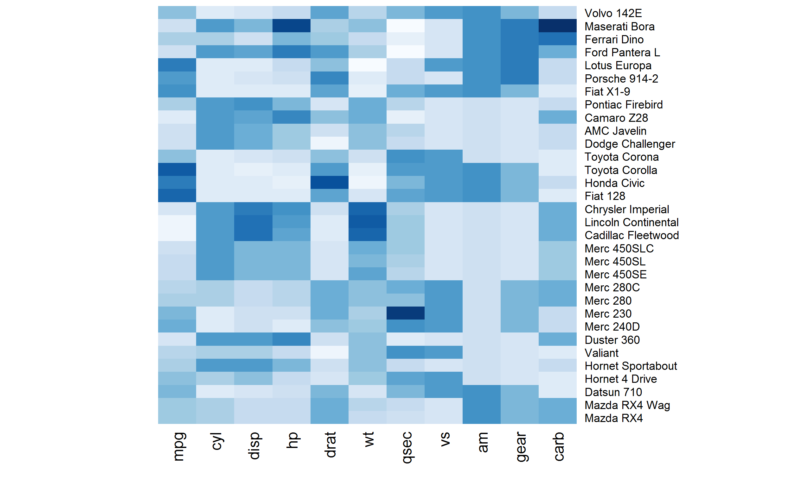](https://github.com/melisadigiacomo/dataviz-cheatsheet/blob/master/heatmap/heatmap.R)

## [Treemap plot](https://github.com/melisadigiacomo/dataviz-cheatsheet/tree/master/treemap)

[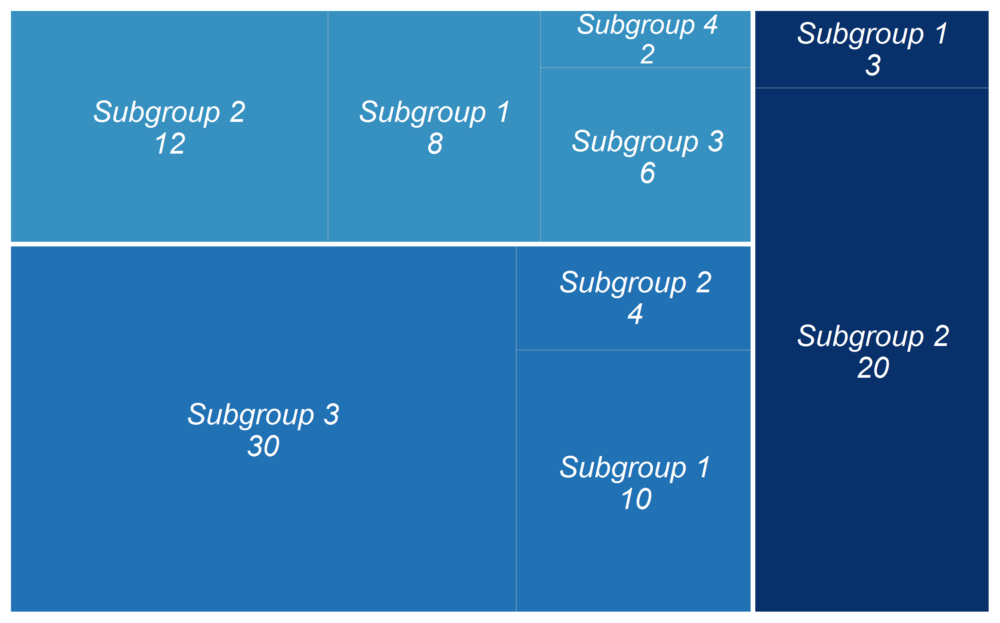](https://github.com/melisadigiacomo/dataviz-cheatsheet/blob/master/treemap/treemap.R)

## [Scatterplot](https://github.com/melisadigiacomo/dataviz-cheatsheet/tree/master/scatterplot)

[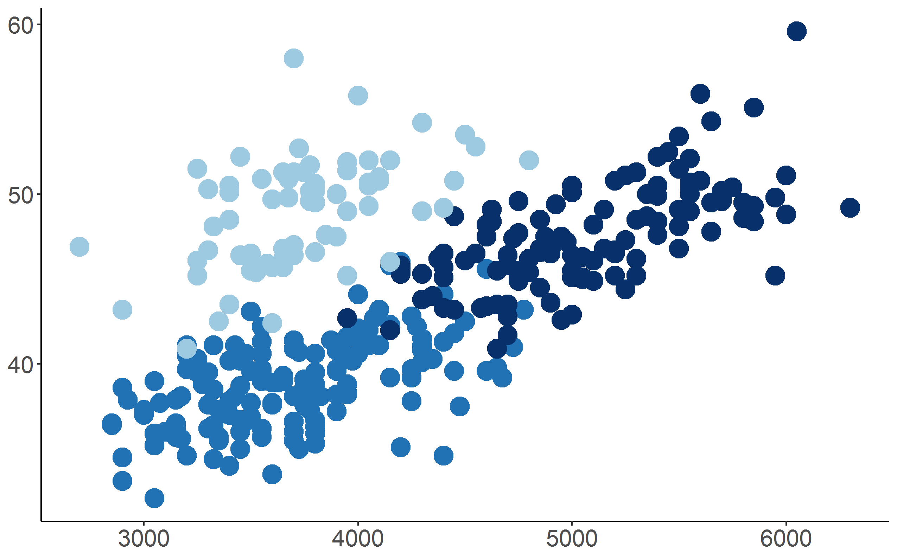](https://github.com/melisadigiacomo/dataviz-cheatsheet/blob/master/scatterplot/scatterplot.R)

## [Pairplot](https://github.com/melisadigiacomo/dataviz-cheatsheet/tree/master/pairplot)

[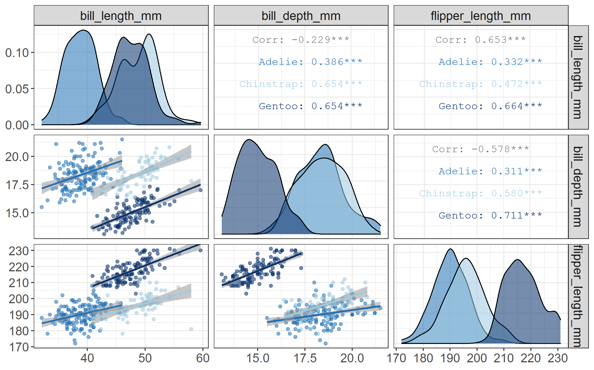](https://github.com/melisadigiacomo/dataviz-cheatsheet/blob/master/pairplot/pairplot.R)

## [Bubble plot](https://github.com/melisadigiacomo/dataviz-cheatsheet/tree/master/bubbleplot)

[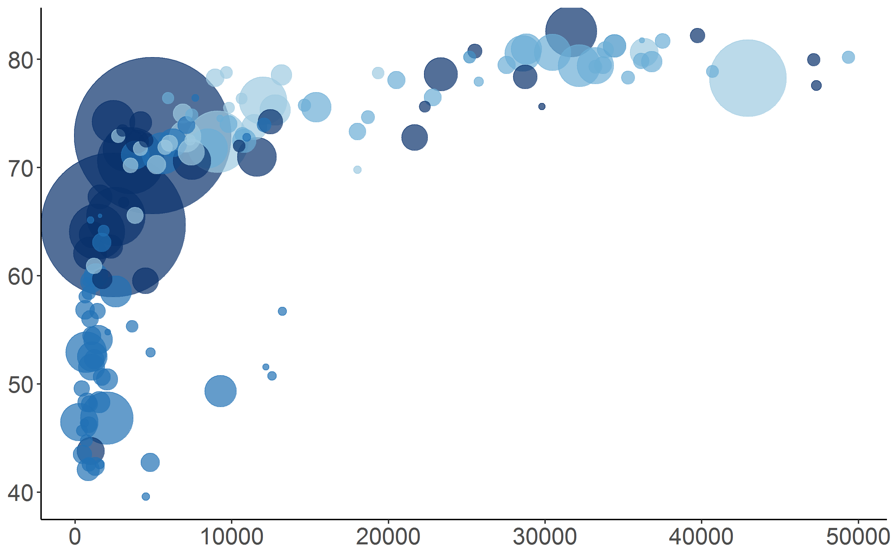](https://github.com/melisadigiacomo/dataviz-cheatsheet/blob/master/bubbleplot/bubbleplot.R)

## [Lollipop plot](https://github.com/melisadigiacomo/dataviz-cheatsheet/tree/master/lollipop)

[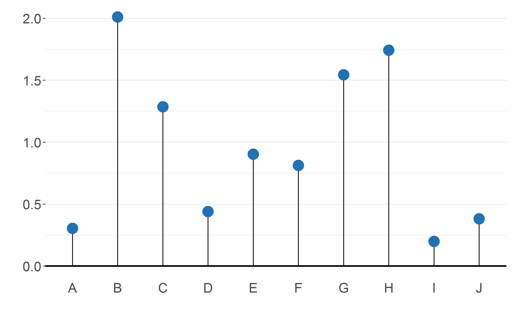](https://github.com/melisadigiacomo/dataviz-cheatsheet/blob/master/lollipop/lollipop.R)

## [Density plot](https://github.com/melisadigiacomo/dataviz-cheatsheet/tree/master/densityplot)

[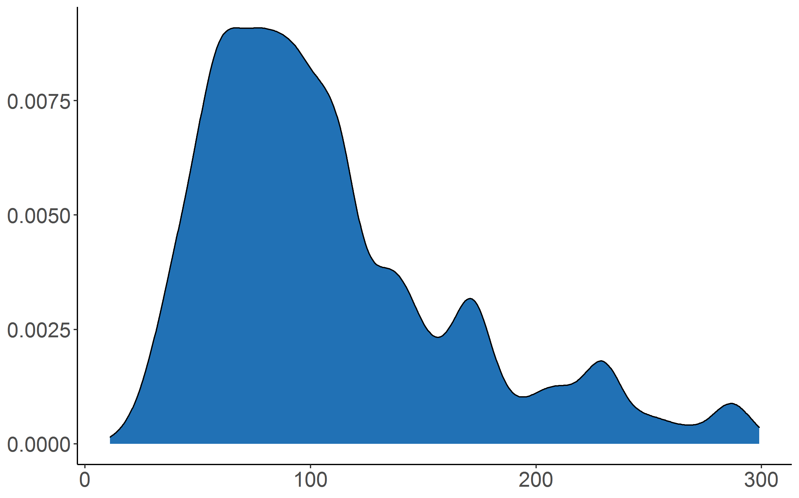](https://github.com/melisadigiacomo/dataviz-cheatsheet/blob/master/densityplot/desnityplot.R)

## [Distribution plots](https://github.com/melisadigiacomo/dataviz-cheatsheet/tree/master/distributionplots)

[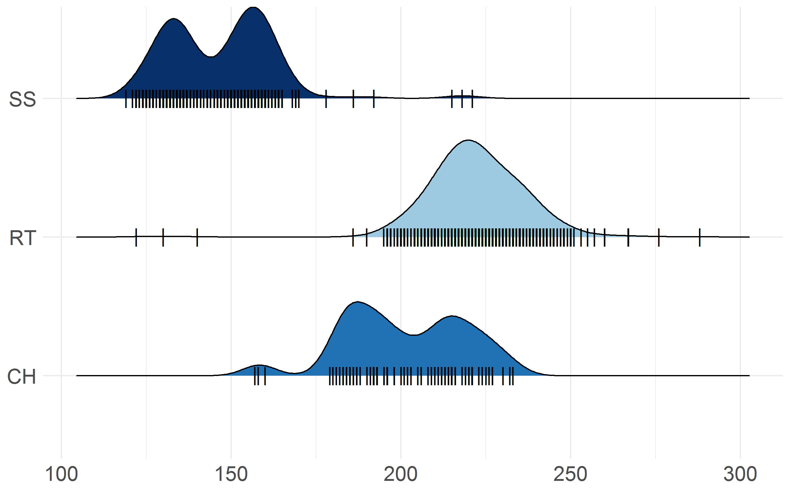](https://github.com/melisadigiacomo/dataviz-cheatsheet/blob/master/distributionplots/distributionplots.R)

## [Strip chart](https://github.com/melisadigiacomo/dataviz-cheatsheet/tree/master/stripchart)

[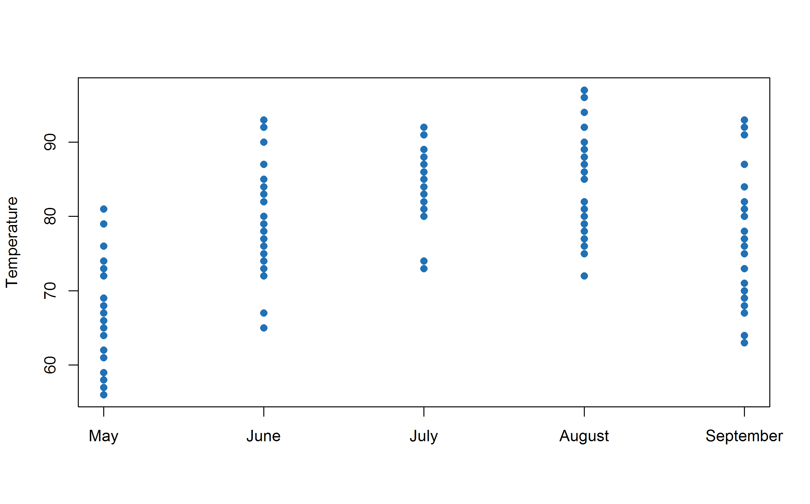](https://github.com/melisadigiacomo/dataviz-cheatsheet/blob/master/stripchart/stripchart.R)

## [Jitter plot](https://github.com/melisadigiacomo/dataviz-cheatsheet/tree/master/jitterplot)

## [Boxplot](https://github.com/melisadigiacomo/dataviz-cheatsheet/tree/master/boxplot)

[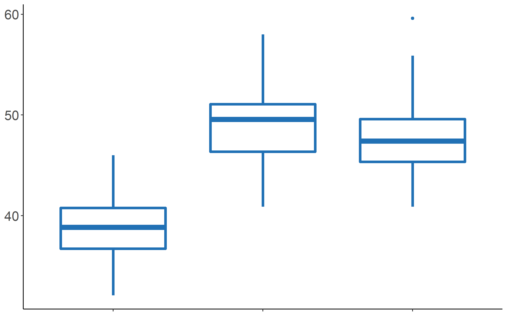](https://github.com/melisadigiacomo/dataviz-cheatsheet/blob/master/boxplot/boxplot.R)

## [Violin plot](https://github.com/melisadigiacomo/dataviz-cheatsheet/tree/master/violinplot)

[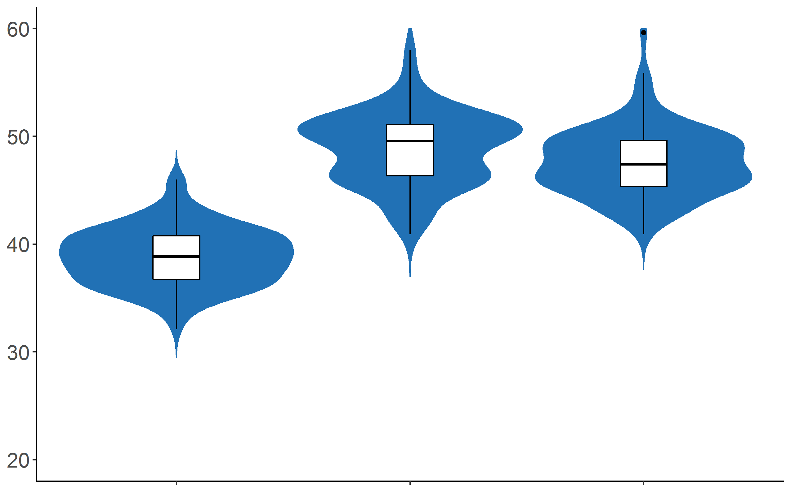](https://github.com/melisadigiacomo/dataviz-cheatsheet/blob/master/violinplot/violinplot.R)

## [Candlestick plot](https://github.com/melisadigiacomo/dataviz-cheatsheet/tree/master/candlestick)

[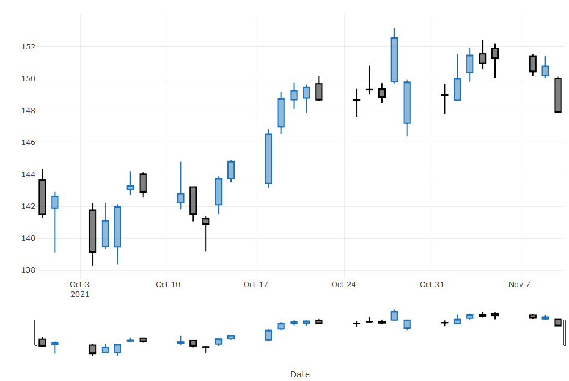](https://github.com/melisadigiacomo/dataviz-cheatsheet/blob/master/candlestick/candlestick.R)