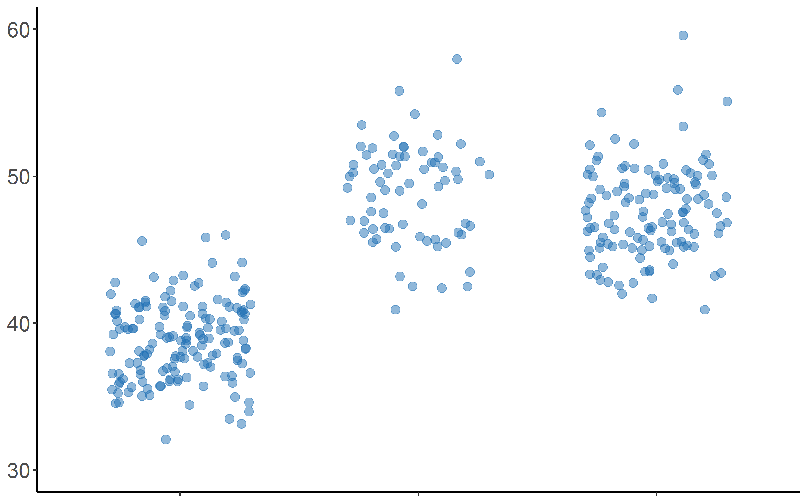

# Data Viz cheatsheet  

## Overview  

This is a repo that aims to provide a variety of charts with a simple R code to implement them. It is a cheatsheet for selecting the appropriate information for your dataset. Each type of chart comes with a sample dataset to test it first. The output plot is provided as a png file.  

## Code and Resources Used

**R Version:** 3.6.3  
**Packages:** ggplot2, dplyr, tidyverse, wordcloud, ggpubr, fmsb, VennDiagram  

## [Barplot](https://github.com/melisadigiacomo/dataviz-cheatsheet/tree/master/barplot)

  

## [Stacked barplot](https://github.com/melisadigiacomo/dataviz-cheatsheet/tree/master/stacked-barplot)

  

## [Percent stacked barplot](./percent-stacked-barplot)

   

## [Circular barplot](./circular-barplot)

## [Piechart](./piechart)

## [Radar chart](./radarchart)

## [Venn diagram](./venndiagram)

## [Wordcloud](./wordcloud)

## [Heatmap](./heatmap)

## [Scatterplot](./scatterplot)

## [Bubble plot](./bubbleplot)

## [Lollipop plot](./lollipop)

## [Density plot](./densityplot)

## [Jitter plot](./jitterplot)

## [Boxplot](./boxplot)

## [Violin plot](./violinplot)

