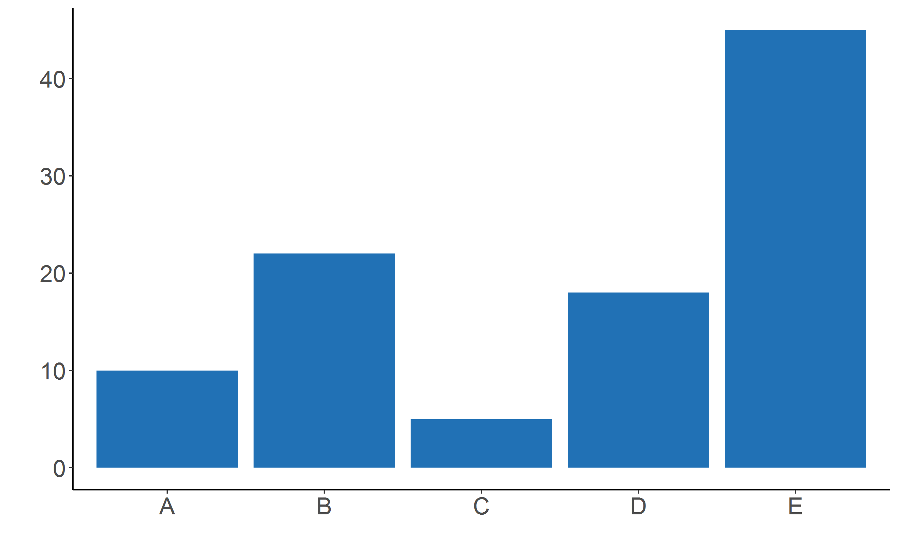

# Barplot

```r
# Barplot

# Library
library(ggplot2)

# Create data
data <- data.frame(
  name=c("A","B","C","D","E") ,  
  value=c(10,22,5,18,45)
)

# Barplot
ggplot(data, aes(x=name, y=value)) + 
  geom_bar(stat = "identity", fill="#2171b5") +  
  theme_classic() + labs(x = "", y = "") +
  theme(text = element_text(size=20)) 
``` 
