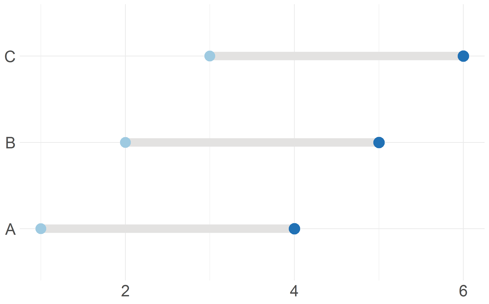

# Dumbbell plot

```r
# Dumbbell plot

# Library
library(ggplot2)

# Create some data to use in the dumbbell plot
data <- data.frame(
  group = c("A", "B", "C"),
  value1 = c(1, 2, 3),
  value2 = c(4, 5, 6)
)

# Create the dumbbell plot using the geom_dumbbell() function
ggplot(data, aes(x = value1, xend = value2, y = group, yend = group)) +
  geom_dumbbell(size=5, color="#e3e2e1",
                colour_x = "#9ecae1", colour_xend = "#2171b5",
                dot_guide= FALSE) +
  labs(x=NULL, y=NULL) +
  theme_minimal() +
  theme(axis.text = element_text(size = 20))
``` 

