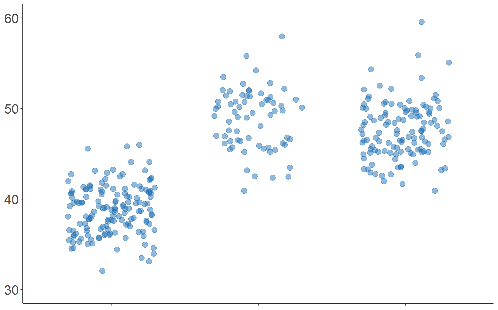

# Jitter Plot

```r
# Jitter plot

# Libraries
library(palmerpenguins)
library(ggpubr)
library(ggplot2)

# Seed
set.seed(2021)

## Read dataset Palmer Penguins
data = penguins
data <- na.omit(data)

## Jitter plot
ggplot(data, aes(species, bill_length_mm, color = "#2171b5")) +
  geom_jitter(position = position_jitter(seed = 2021, width = 0.3), size = 3, alpha = 0.5) + 
  scale_color_manual(values=c("#2171b5")) +
  scale_y_continuous(limits = c(30, 60)) +
  theme_classic() +
  theme(text = element_text(size=20),
        legend.position="none",
        axis.text.x = element_blank(),
        axis.title = element_blank())
``` 
