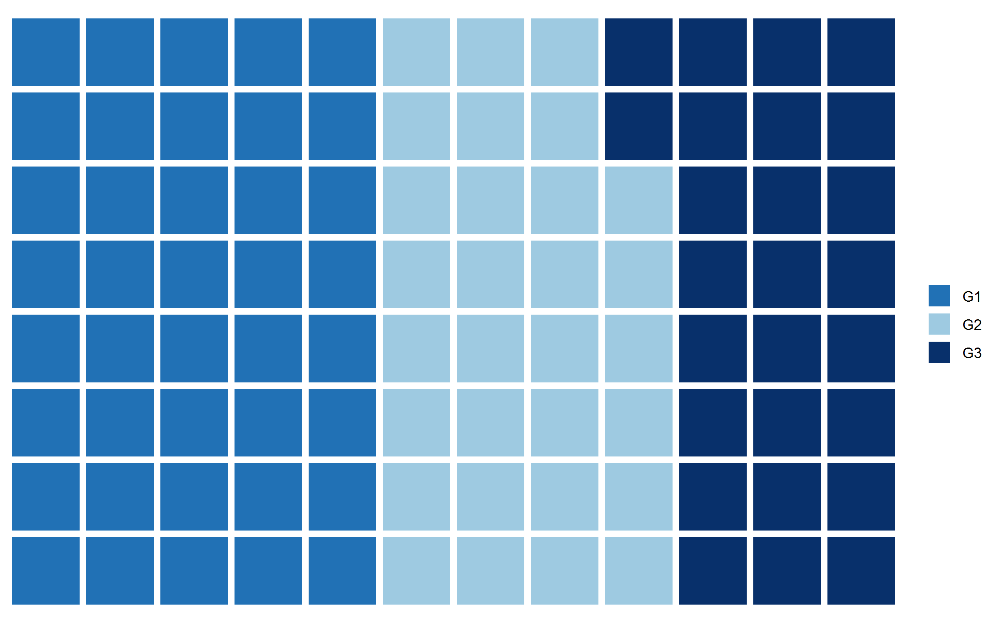

# Waffle chart

```r
# Waffle chart

# Libraries
#install.packages("waffle", repos = "https://cinc.rud.is")
library(waffle)
library(ggplot2)

# Data
df <- data.frame(grupo = LETTERS[1:3],
                 valor = c(25, 20, 35))

# Data
x <- c(G1 = 40, G2 = 30, G3 = 26)

# Waffle chart
waffle(x, rows = 8,
       colors = c("#2171b5", "#9ecae1", "#08306b"))
``` 
