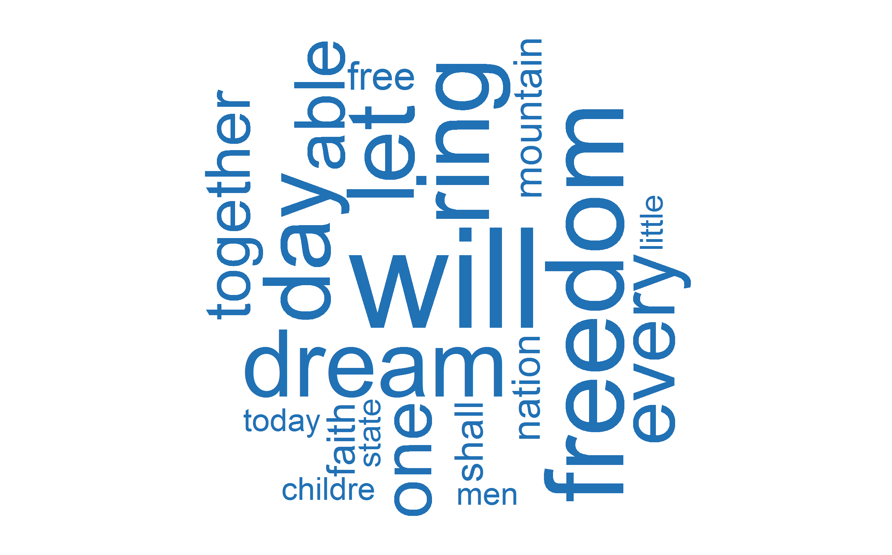

# Wordcloud

```r
# Wordcloud

# Library
library(wordcloud)

# Create data from I have a dream speech
data <- data.frame(
  word=c("will","freedom","ring","dream","day", "let", "every", "one", "able", "together", 
         "nation", "mountain", "shall", "faith", "free","today", "men", "state", "childre", "little") ,  
  freq=c(17,13,12,11,11,11,9,8,8,7,4,4,4,4,4,3,3,3,3,3)
)

# Set seed
set.seed(1234) 

# Wordcloud
wordcloud(words = data$word, freq = data$freq, scale=c(8,.5), 
          min.freq = 1,           
          max.words=20, random.order=FALSE, rot.per=0.35,            
          colors=("#2171b5"))
``` 
